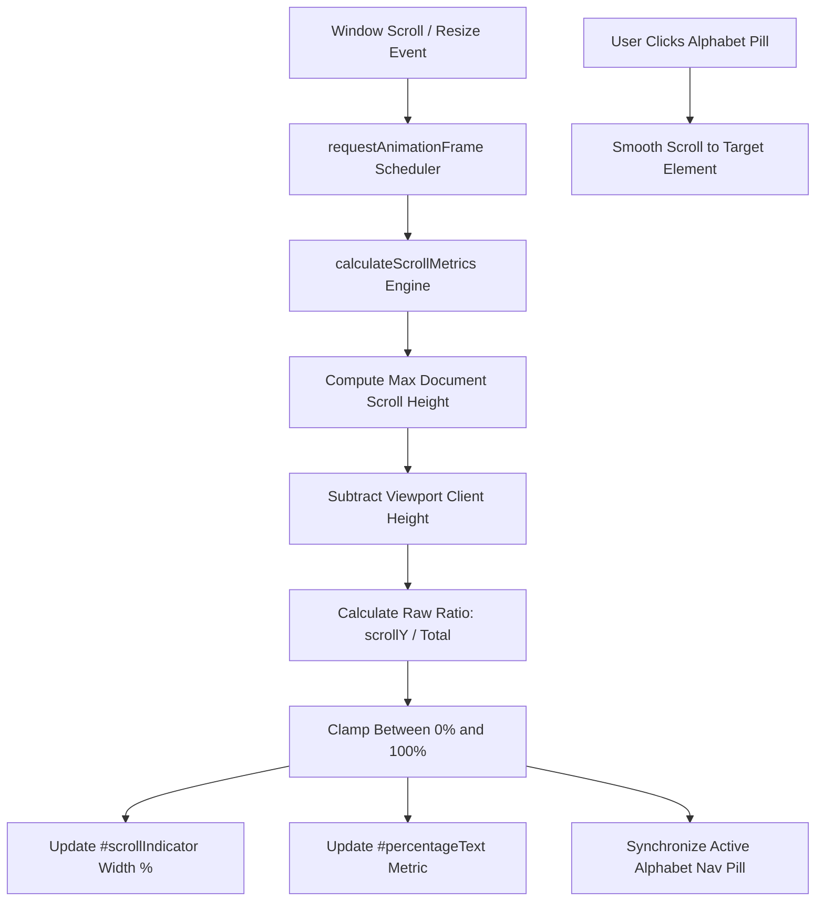

# Scroll Bar Indicator - Real-Time Reading Telemetry

[](https://developer.mozilla.org/en-US/docs/Web/HTML)
[](https://developer.mozilla.org/en-US/docs/Web/CSS)
[](https://developer.mozilla.org/en-US/docs/Web/JavaScript)
[](https://nodejs.org/)
[](https://opensource.org/licenses/MIT)

A modern, high-precision reading progress and scroll telemetry engine designed for web applications, long-form articles, and documentation platforms. Features dynamic document height calculation, boundary clamping, 60fps requestAnimationFrame scheduling, and an interactive alphabetical quick-jump navigation rail.

---

## Overview

Scroll Bar Indicator provides visual feedback regarding how much of a document has been consumed. By measuring viewport scroll offsets against total scrollable distance, it translates user position into a smooth progress track and live percentage indicator.

---

## Key Features

- **Dynamic Height Adaptation**: Automatically recalculates document height across viewport resize events and content rendering shifts.
- **Overscroll Boundary Clamping**: Prevents negative or overflow percentage anomalies caused by elastic rubber-band scrolling on iOS and macOS.
- **60fps Scheduled Rendering**: Utilizes requestAnimationFrame throttling to avoid scroll jank and prevent layout thrashing.
- **Real-Time Numeric Telemetry**: Renders an updated percentage badge alongside the visual progress bar.
- **Alphabetical QuickNav Rail**: Interactive alphabet bar enabling instant smooth scrolling to corresponding lexicon cards.
- **Modern Glassmorphic UI**: High-contrast dark theme with glowing neon gradients, styled cards, and fluid responsive typography.
- **Floating Navigation Actions**: Quick jump-to-top and jump-to-bottom action buttons.
- **Zero Dependencies**: Pure vanilla JavaScript and native CSS variables without external libraries.

---

## Architecture & Data Flow



---

## Project Structure

```text
Scroll-bar-indicator/
├── .gitignore                   Standard Git exclusion patterns
├── index.html                   Semantic markup, lexicon directory, and quicknav rail
├── index.js                     Scroll metric calculations, rAF loop, and navigation
├── README.md                    Startup documentation and architecture specification
├── style.css                    Glassmorphism styling, animations, and responsive layout
└── tests/
    └── test_scroll_indicator.js Unit test suite for scroll mathematics and boundary clamping
```

---

## Getting Started

### Prerequisites

- Any modern web browser (Google Chrome, Mozilla Firefox, Microsoft Edge, Apple Safari)
- Optional: Node.js (version 16 or newer) for executing the automated unit test suite

### Running the Application

1. Clone the repository:

```bash
git clone https://github.com/Kumar44developer/Scroll-bar-indicator.git
cd Scroll-bar-indicator
```

2. Open the application directly in your browser:

Launch the file via system default browser:

```bash
start index.html
```

Or serve via an HTTP server:

```bash
npx serve .
```

---

## Automated Testing

The project includes an automated unit test suite verifying top-of-page zero baseline, midpoint accuracy, bottom-of-page completion, overscroll boundary safety, and division-by-zero protection.

Run the test suite using Node.js:

```bash
node tests/test_scroll_indicator.js
```

Expected output:

```text
Running Scroll Bar Indicator Unit Tests...

PASS: Top of page yields 0%
PASS: Midpoint scroll accurately calculates 50%
PASS: Bottom of page reaches exact 100%
PASS: Overscroll boundary safely clamped between 0% and 100%
PASS: Non-scrollable contents avoid division by zero and return 0%

All 5 Scroll Indicator unit test suites passed successfully!
```

---

## Technical Specifications

| Component | Technology | Specification |
| :--- | :--- | :--- |
| Markup | HTML5 | Accessible semantic layout, scroll anchors |
| Styling | CSS3 | CSS Grid, Flexbox, custom properties, glassmorphism |
| Typography | Google Fonts | Outfit (headings) and Plus Jakarta Sans (body) |
| Runtime Logic | JavaScript (ES6+) | Event-driven architecture, requestAnimationFrame |
| Verification | Node.js | Native assertion harness |

---

## Browser Support

- Google Chrome: Version 88+
- Mozilla Firefox: Version 85+
- Microsoft Edge: Version 88+
- Apple Safari: Version 14+
- Mobile Safari & Chrome for Android

---

## License

This project is licensed under the MIT License. Open source and available for personal and commercial use.
